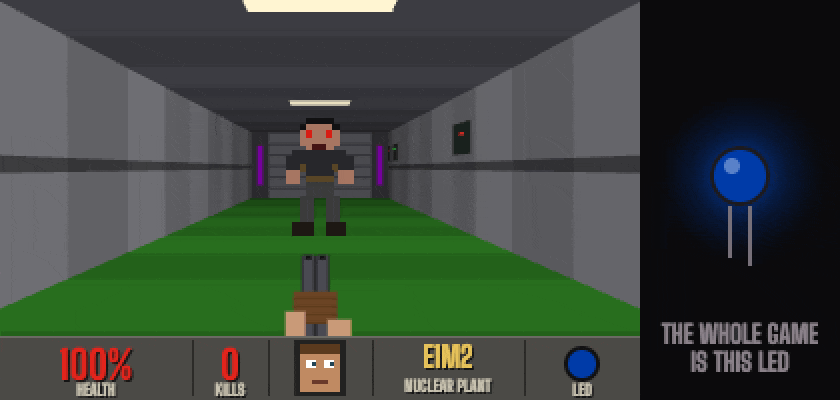

# LED Doom

The first episode of Doom, played on a single RGB LED with a single button. The whole game state collapses to one colour per frame, and the whole input collapses to whether the button is down.

**Play it in the browser: https://pragyaangaur.github.io/LED-Doom/**



The GIF is five seconds of the real game played by the test bot, which watches only the LED. The screen on the left shows what the game looks like from inside, and the light on the right is everything the player actually gets.

The game runs in two places. `web/` is a browser version with a drawn LED and a drawn button. `arduino/doom_led/` is the same game for a real LED and a real button on an Arduino Uno, Nano or ESP32.

The page also has a screen. It draws a 320 by 200 first-person view of whatever the LED is doing. You see the corridor you are walking down, and the imp in front of you winding up a fireball. You also see the shotgun, the door sliding open, and a status bar with your health and a face that gets bloodier. The screen only reads the game and never changes it, so the LED is still the whole game, and the screen is there to show that it really is Doom. It can be switched off for LED-only play. All the art is drawn in code from small bitmaps, so none of it comes from id Software.

## Reading the light

| Light | Meaning | What the button does |
| --- | --- | --- |
| Blue | Corridor. It dims as you lose health and shimmers while you walk. | Hold to walk forward. |
| Red | An enemy. It swells as the enemy winds up, then flickers when you are hit. A faint red is a spectre. | Tap to shoot. Holding does nothing. |
| Green | Your shot landed. A long green is a kill. | Keep tapping. |
| Yellow | A stimpack (+10) or medikit (+25). It fades out over 2.5 s. | Tap to pick it up before it fades. |
| Purple | A door, pulsing slowly. | Tap to open it. |
| White | Exit. It then blinks once per map number for the next map. | Wait. |
| Off | Dead. | Hold for one second to retry the map with full health. |

At the end of E1M8 the light cycles through every colour. Hold to start again from E1M1.

## The maps

The eight maps of Knee Deep in the Dead are flattened into strings, with one character per thing you meet. A `.` is a stretch of corridor that takes 0.7 s of holding to cross. Enemies are zombiemen, shotgun guys, imps, demons, spectres and two barons of hell at Phobos Anomaly. They take 1, 2, 3, 6, 6 and 16 shots. The real level geometry is not used, so these are the original levels in name and enemy roster only.

Health carries from map to map. Dying restarts the current map at 100.

## Play in the browser

Open the GitHub Pages link above, or run it locally:

```bash
npm start
```

Then open http://localhost:8417. The button takes the mouse, touch, Space or Enter. Sound is synthesised in the browser and can be turned off.

## Play on a board with the screen in front of you

1. Wire the board as in the next section and upload the sketch.
2. Leave it plugged in over USB.
3. Open the GitHub Pages link, or run `npm start`, in Chrome or Edge. Safari and Firefox do not have Web Serial.
4. Press Connect Arduino and pick the board's port. On a Mac it looks like `cu.usbmodem…` or `cu.usbserial…`.

The board restarts when the port opens, so the game starts at E1M1. From then on you play with the real button and watch the real LED, and the screen follows the board. The on-screen button is turned off while a board is connected. Close the Arduino IDE serial monitor first, since only one program can hold the port.

The sketch sends one line of state over serial every 20 ms at 115200 baud, for example `D,2,0,1,94,0,640,5210,0,2,410,0,0,0,0,0,0,0`. The fields are listed above `report()` in the sketch. `web/serial.js` reads them back into a game object, so the page draws the board's game with the same code it uses for its own. The browser only listens and never sends anything to the board, and the board plays the same with nothing connected.

## Build the hardware

You need a board, an RGB LED, a push button, some jumper wires and a USB cable that carries data. The USB cable also powers everything. A breadboard helps with the button but is optional.

| LED or button | Arduino Uno or Nano | ESP32 dev board |
| --- | --- | --- |
| LED red | pin 9 | GPIO 25 |
| LED green | pin 10 | GPIO 26 |
| LED blue | pin 11 | GPIO 27 |
| LED common leg | GND | GND |
| Button, one leg | pin 2 | GPIO 14 |
| Button, the diagonally opposite leg | GND | GND |

The sketch picks the right pins for the board it is built for. The ESP32 needs its own pins because its GPIO 6 to 11 are wired to the flash chip.

A bare RGB LED needs a 220 ohm resistor on each of the three colour legs. LED modules such as the HW-479 or KY-016 usually have these resistors on the module already. The sketch assumes a common cathode LED, which is what those modules are. For a common anode LED, connect the common leg to 5V and set `COMMON_ANODE` to 1 at the top of the sketch. The button needs no resistor because the sketch uses the board's internal pull-up.

Open `arduino/doom_led/doom_led.ino` in the Arduino IDE and upload it, or from the terminal:

```bash
arduino-cli compile --upload --fqbn arduino:avr:uno --port /dev/cu.usbmodem1101 arduino/doom_led
```

Change the board and port to what `arduino-cli board list` shows. The sketch squares each colour value before writing PWM, so dim states such as low health blue and the spectre stay visibly dim.

## Tests

```bash
npm test
```

The main test is a bot that sees only the LED colour and presses only the button. It sorts each frame into one of the seven colours, reacts after 180 ms, holds on blue and taps on red, yellow and purple. It clears all eight maps of the browser version without dying.

The same bot then plays the sketch. The test compiles the sketch for the laptop against a small fake of the Arduino API in `test/host/`, and the bot clears it too. While it plays, every serial report is read back through `web/serial.js`, and the colour the browser works out from it is compared with the colour the sketch is writing to the LED. They agree to within 2 out of 255 on every report, and the reports cover enemies, shots, kills, pickups, doors and exits. A separate test checks that the sketch's maps, enemy numbers and timings match `web/game.js`, because the sketch is a hand port.

The screen test draws every frame of a full playthrough, a death and a restart without an error, and checks every sprite bitmap for ragged rows and missing colours.

Difficulty was tuned with the same bot. A player who reacts in 250 ms and taps about six times a second finishes with health to spare. At 400 ms and about three and a half taps a second the bot scrapes through E1M8 with 5 health. At 500 ms and three taps a second it gets stuck on E1M7.

## Limits

The sketch has not been run on a physical board yet, so the serial link has not been tried against real USB either. It compiles and plays correctly on the host harness, and its serial output is tested there, but it has not yet been compiled for the AVR or ESP32 targets. Floating point use is modest, the game updates at 100 Hz and a serial report takes about 6 ms of each 20 ms, which an Uno should handle. The first real upload is the real test.

## Licence

MIT. Doom is a trademark of id Software. This project uses the name and the episode's map names and contains no code or art from the original game.
